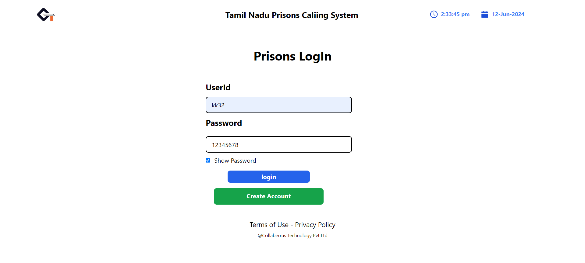

## Overview
This repository contains a Prisons Calling System application built using React.js for the frontend for the system of calling prisons can call to relative of a particular system to reach out to relative.

## About Prisons Calling System
- ** Project with Shimmer UI Effect, Search bar, Pagination Design in Tailwind CSS

## Tech Stack
### Frontend
- **React.js**: For building the user interface.
- **Redux/Toolkit**: For state management.
- **React Router Dom**: For navigation.
- **Axios/Fetch API**: For making HTTP requests.
- **formik/Yup** : for all Form Validation
- **Moment.js**: For making to show real time.
- **React-Icons**: For All Icons show in site.
- **Antd** : for all Notification in all app.

